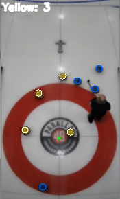

# Curling Score Detector

### Screenshot

## Motivation
I recently got into curling and was looking for streams to be able to watch some curling and get better. I came across this [stream](https://www.youtube.com/watch?v=usWs96-6-O0) a with a perfect overhead view of the house. Previously I have taken a computer vision and a computation photography class in my masters program and was looking for practical applications of the skills that I had gained. I wanted to see if I would be able to detect the current score of the end by using the overhead views that are on the stream. While it is relatively easy to keep score by just looking at the house, I thought it would be a good test of my skills and nice double check that you scored the end correctly.

## How it works
pass

## Potential Applications
This could be applied to couple of different things that would be useful outside of just keeping track of the score.
- If you were able to project this down on to the ice from above, you would have a live view of the current score on the ice for people standing on that side of the ice. 
  - This could also be used for training new skips on where to position their calls 
  - Or it could be used to track the position of previous calls and where they ended up in the house.
- There could be analytics built around the accuracy/success rate of shooters automatically, rather than manually enter this information.

## Things to do
- Improve overall stability of the program. It sometimes have false positives when people are walking around and I would like to reduce those when possible
- Improve the generalization of this. Currently I am heavily relying on the colors in the stream that I found, this means that it wouldn't be great for any other place that has a similar setup camera wise. Using different techniques to detect all the object might need to explored rather than the ones currently being used.
- Lots more. I will continue to update this as I think of more. 

